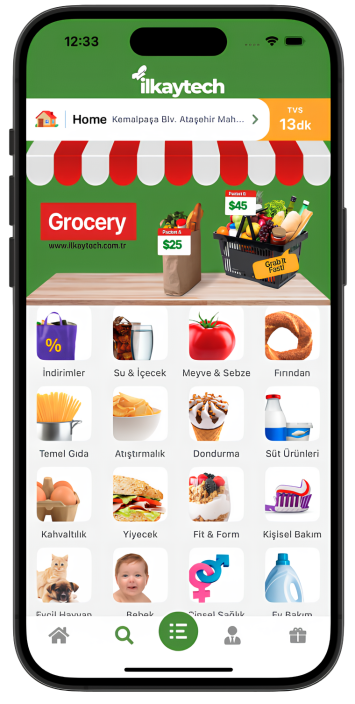

<h1 align="center">
   Grocery Store
</h1>

  Select the category you want to buy, find the product, add to cart and buy.   Built with React Native, Expo and AWS Amplify..

  

 
⚒️ Core Tech Stack
</h2>

- 🔼 &nbsp; [Expo](https://expo.io/ "Expo")
- ⭐️ &nbsp; [React Native](https://reactnative.dev/ "React Native")
- 🔗 &nbsp; [React Navigation](https://reactnavigation.org/ "React Navigation")
- 🎭 &nbsp; [Styled Components](https://styled-components.com/ "Styled Components")
- 🔥 &nbsp; [AWS Amplify (AWS AppSync GraphQL API, Amazon Cognito, Datastore, Amazon S3, Real-time Data Subscriptions and more)](https://aws.amazon.com/amplify/)
- 🔥 &nbsp; [React Native Testing Library and Jest](https://callstack.github.io/react-native-testing-library/)
- ⭐️ &nbsp; [State Management with Redux](https://redux.js.org/)
- 🔗 &nbsp; [EAS Build](https://docs.expo.dev/build/introduction/)
- 🔼 &nbsp; [Hermes Engine](https://hermesengine.dev/)
- 🔥 &nbsp; [Stripe](https://stripe.com/)
<h2>
 

## Install (dev)

To install the project, navigate to the directory and run:

- `yarn global add expo-cli`
- `yarn install`

## Run

To run the project, run the following commands:

- `yarn android`
- `yarn ios`

<h2>
 
